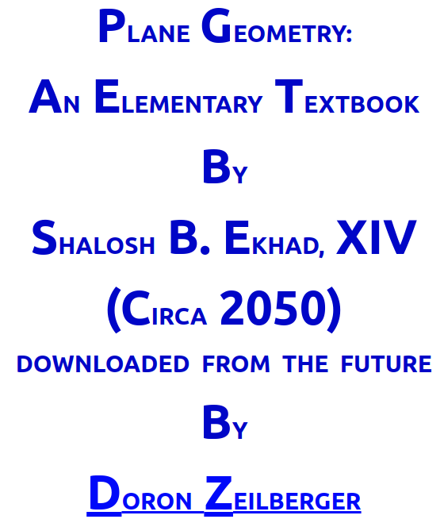
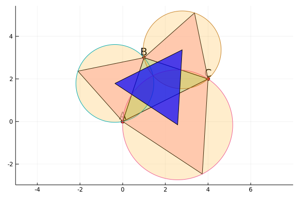

# Introduction

*This website originated from a [blog
post](https://newptcai.github.io/euclidean-plane-geometry-with-julia.html) I wrote. I have since
cleaned up the code and put everything into a Julia package
[PlaneGeometry.jl](https://github.com/newptcai/PlaneGeometry.jl).*

## A book from the future

When I first got interested in computer algebra systems (CAS), I came across a
[book](https://sites.math.rutgers.edu/~zeilberg/GT.html)




Of course, Shalosh is not really a time traveler from a future. He/she/it is the computer of [Doron
Zeilberger](https://sites.math.rutgers.edu/~zeilberg/), a mathematician who has been
[advocating](https://sites.math.rutgers.edu/~zeilberg/OPINIONS.html) for the use of computers in
mathematics for decades. He often writes articles and papers with Shalosh named as a co-author.

.jpg)
```@raw html
<center>
    Doron Zeilberge (circa 2005) from <a
    href="https://en.wikipedia.org/wiki/Doron_Zeilberger">Wikipeida</a>
</center>
```

The book title is just a joke 😀️. What Zeilberger really wants to say is that in the future, kids
won't need to learn to do (at least) plane geometry with pencil and paper any more. Their homework
will be writing codes so their computer 🤖️ will do the mathematics for them.

## A new book with Julia


Zeilberger's book was created with Maple, a powerful commercial CAS. But in principle, this can be done
in any programming languages, e.g., [Julia](https://julialang.org/), which is a *fast,
dynamically and optionally typed, easy-to-use, open-sourced* modern programming language. Its syntax is
similar to `Python`, but superior in my opinion 🤓️.  

Admittedly, Julia is not a CAS. But with the
package [SymPy.jl](https://github.com/JuliaPy/SymPy.jl) handling symbolic computation and
[Plots.jl](https://github.com/JuliaPlots/Plots.jl) drawing nice pictures, Julia is a reasonably
good choice for writing a book like the one Zeilberger wrote.

So I have written a Julia package [PlaneGeometry.jl](https://github.com/newptcai/PlaneGeometry.jl)
to create Zeilberger's book. The purpose is mainly to demonstrate the use of various
Julia packages, and for myself to learn a bit more about programming in Julia.

## PlaneGeometry.jl



You can learn how to install Julia [here](https://julialang.org/downloads/). I will assume that you
have already done that and learned a bit about how to use Julia.

To install PlaneGeometry.jl, open the [Julia REPL](https://docs.julialang.org/en/v1/stdlib/REPL/) and run the following
code.

```julia
using Pkg; 
Pkg.activate("."); 
Pkg.add(PackageSpec(url="https://github.com/newptcai/PlaneGeometry.jl"))
```

After that, you can load PlaneGeometry.jl in to REPL by

```julia:./using
using PlaneGeometry
```

My original [post](https://newptcai.github.io/euclidean-plane-geometry-with-julia.html) is about
proving [Napoleon's theorem](https://en.wikipedia.org/wiki/Napoleon%27s_theorem). You can find a
revised version using PlaneGeometry.jl [here](theorem/Napoleon.md).  Other theorems proved in this
packaged are list [here](theorem/index.md).  There is also a [summary](definition/index.md) of
geometric definitions that we need.
